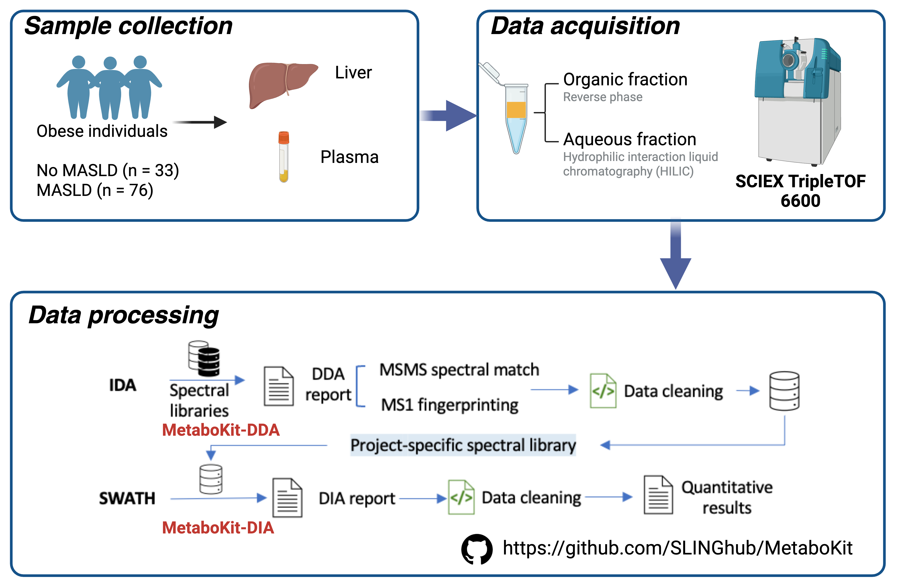

# Dual-omics in obese individuals with MASLD

This repo contains dual-omics data (.RData), clinical data (.RData), along with code to reproduce the main statistical results and code to demonstrate the untargeted metabolomics workflow described in the paper **“Global molecular landscape of early MASLD progression in obesity.”**

## 1. Cohort information - clinical data

Patient characteristics, including ID, demographics, liver histology, and major clinical parameters, are summarized in Table 1.

```{r}
load("Data/Patient_data.RData")
```

## 2. MASLD - Liver transcriptomics

```{r}
# Statistical results
load("Data/liver_transcriptomics_stats.RData")

# Log2 TPM data
load("Data/liver_transcriptomics_data.RData")
```

## 3. MASLD - Liver metabolomics

```{r}
# Statistical results
load("Data/liver_metabolomics_stats.RData")

# Log2 peak area
load("Data/liver_metabolomics_data.RData")
```

## 4. MASLD - Plasma metabolomics

```{r}
# Statistical results
load("Data/plasma_metabolomics_stats.RData")

# Log2 peak area
load("Data/plasma_metabolomics_data.RData")
```

## 5. Code to replicate statistical results and box-plot visualization

Available in the `Stats_demo` folder. The R Markdown script `MASLD stats.Rmd` demonstrates how to reproduce the main statistical results from log2-scaled data (example: liver transcriptomics). It also provides template code to generate publication-ready box plots for selected molecules.


## 6. DDA–DIA workflow for untargeted metabolomics



Available in the `Metabolomics` folder. This folder contains two R Markdown scripts for DDA and DIA post-processing.

**DDA post-processing**

Use the `MetaboKit-DDA` module to process IDA data files. MS/MS spectra are matched against multiple reference libraries (NIST, MSDIAL, HMDB, LipidBlast), while MS1-level fingerprinting is also supported. The script demonstrates a workflow for preliminary filtering of MetaboKit-DDA output to generate a shortlist of candidate IDs (from both MS/MS and MS1), which will be used to build a project-specific spectral library for subsequent SWATH data processing in the MASLD study.

#### DIA post-processing

Filtered MS/MS spectra and MS1-level identifications were used for SWATH data processing with the `MetaboKit-DIA` module. The script demonstrates a workflow for post-processing the MetaboKit-DIA output.
